# Instalar Arduino

Ingresamos al siguiente link <a href="https://www.arduino.cc/en/software" target="_blank">https://www.arduino.cc/en/software</a> y presionamos en **Windows ZIP file**

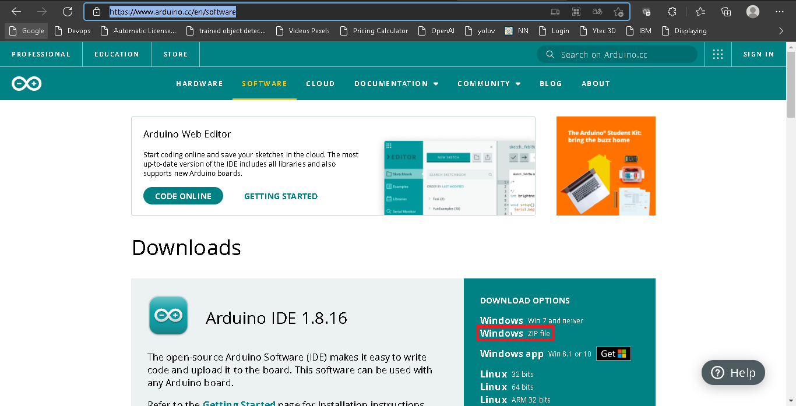

- Presionamos en **JUST DOWNLOAD**

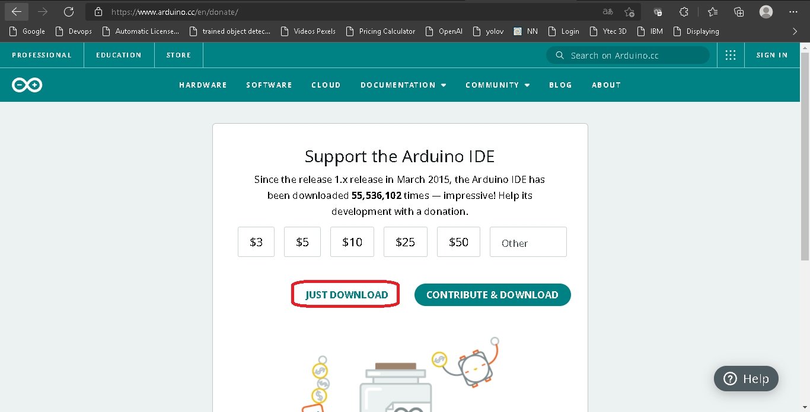

- Guardamos el archivo

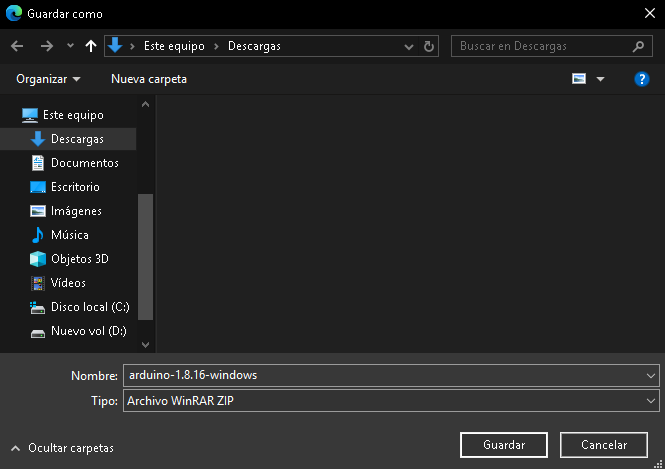

- Descomprimimos el archivo dentro de la misma ruta

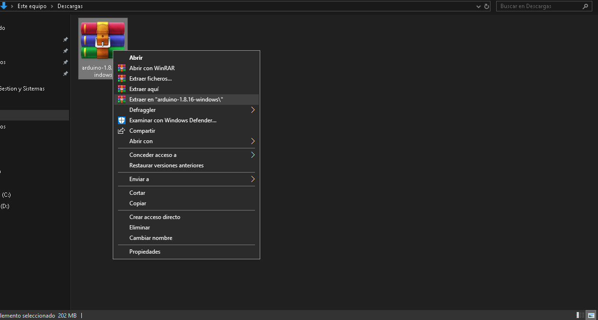

- Ingresamos a la carpeta antes descomprimida y ejecutamos como **Administrador** el archivo **arduino.exe** 

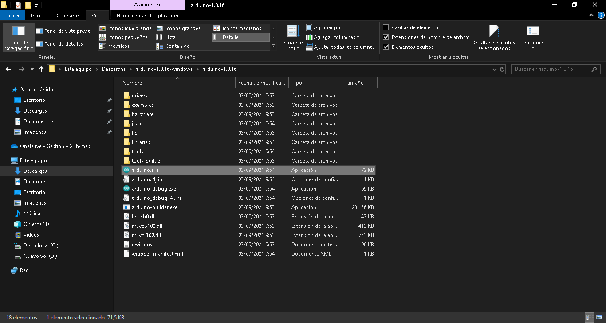

- Presionamos en **Permitir acceso**

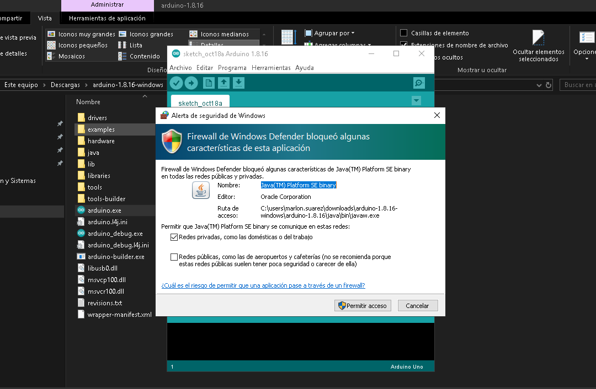

- Listo!!! cuando veamos el ide de Arduino será confirmación de una corecta instalación 

# Instalar Processing

Ingresamos al siguiente link <a href="https://processing.org/download" target="_blank">https://processing.org/download</a> y presionamos en **Windows 64-bit**

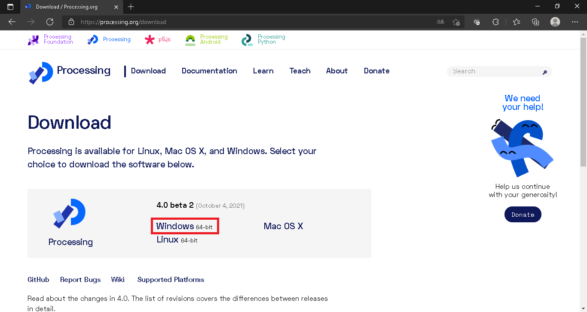

- Guardamos el archivo

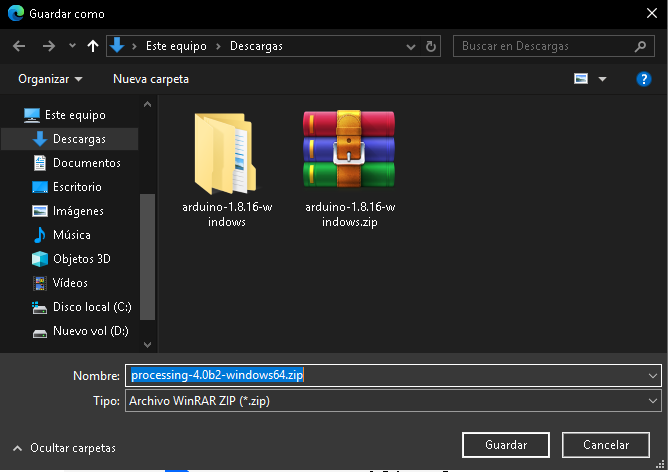

- Descomprimimos el archivo dentro de la misma ruta

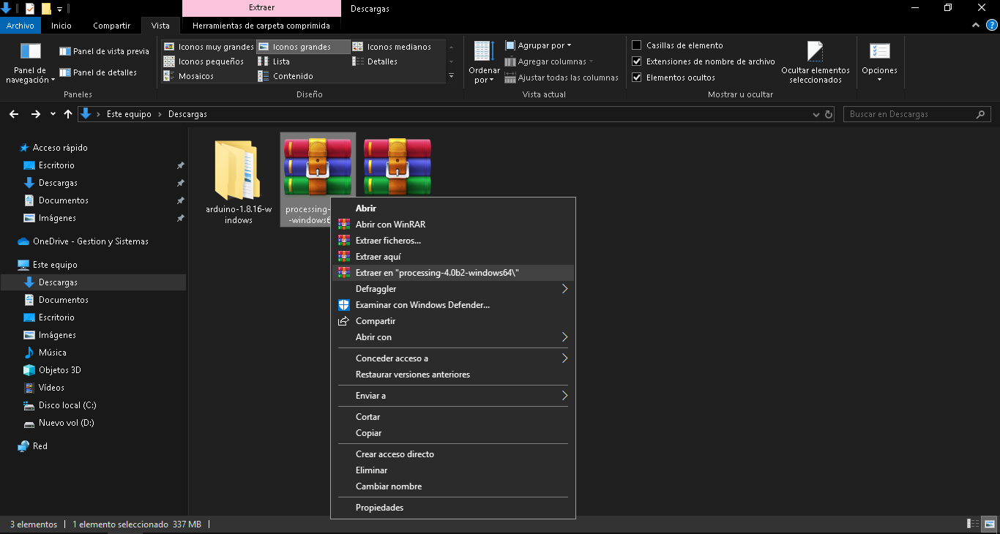

- Ingresamos a la carpeta antes descomprimida y ejecutamos como **Administrador** el archivo **processing.exe** 

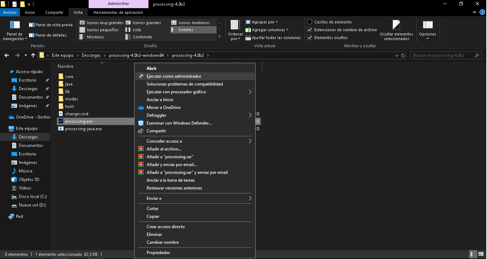

- Presionamos en **Get Started**

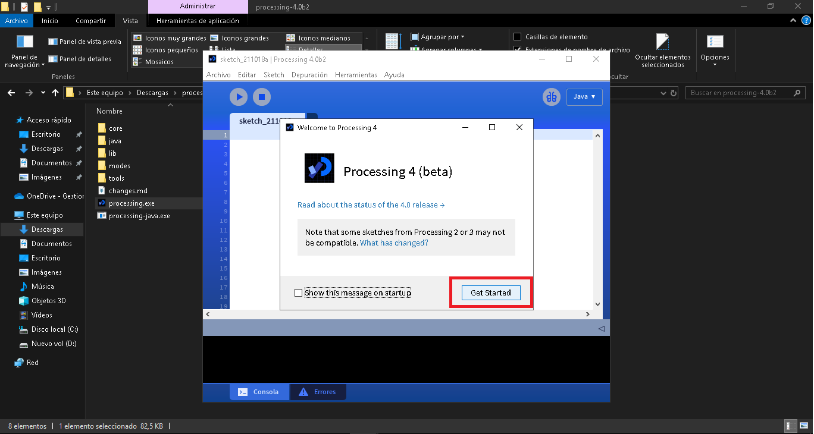

-Listo!!! Cuando veamos el ide de Prossesing será confirmación de una corecta instalación 

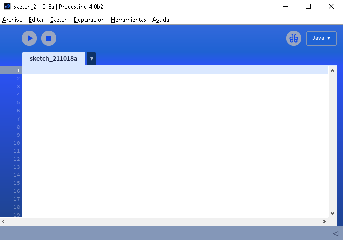
