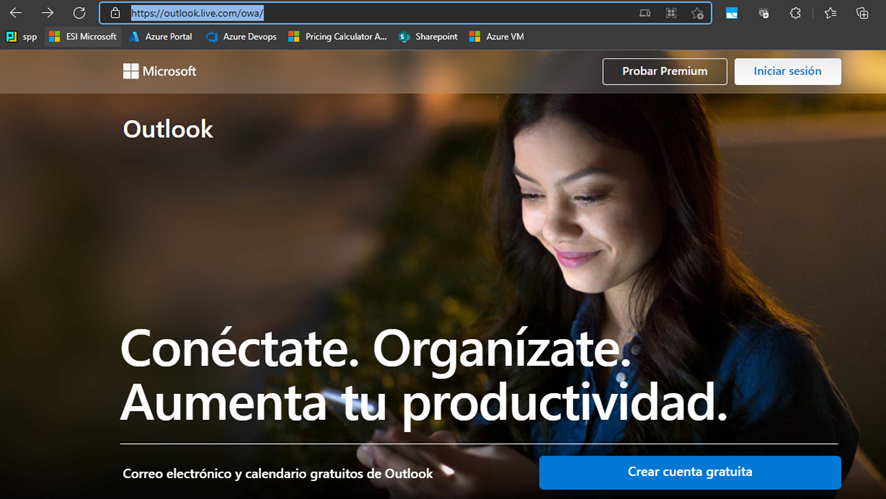
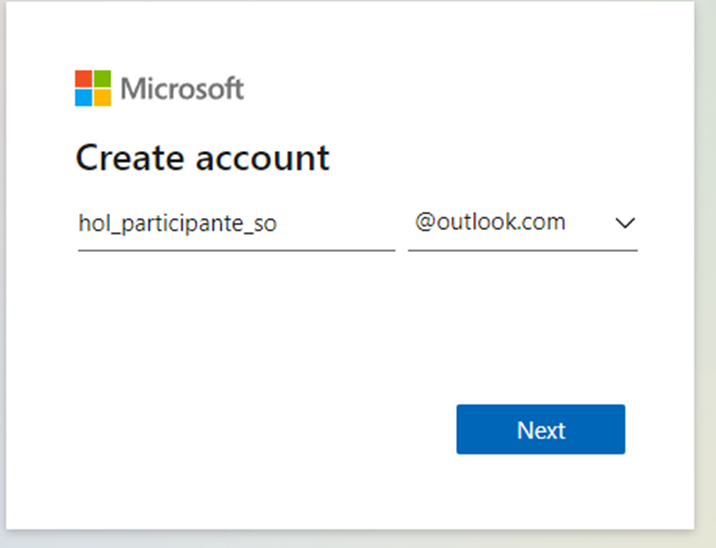
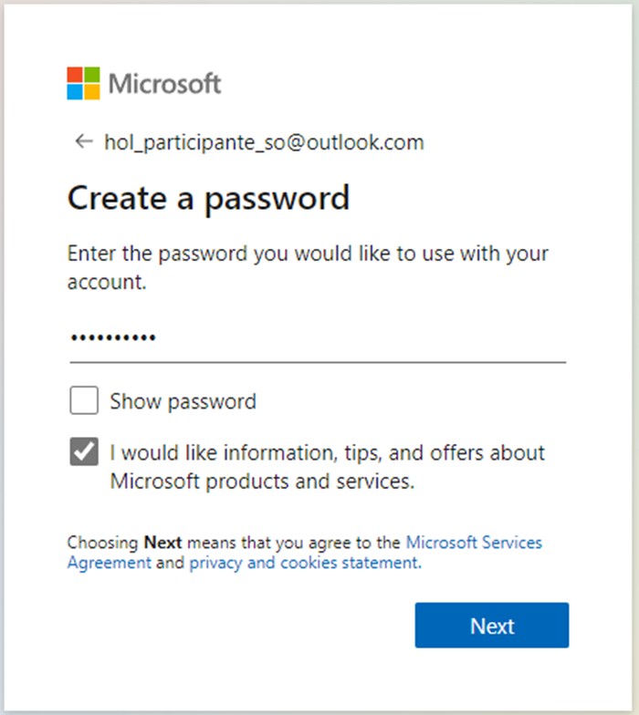
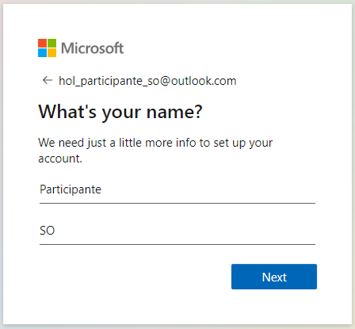
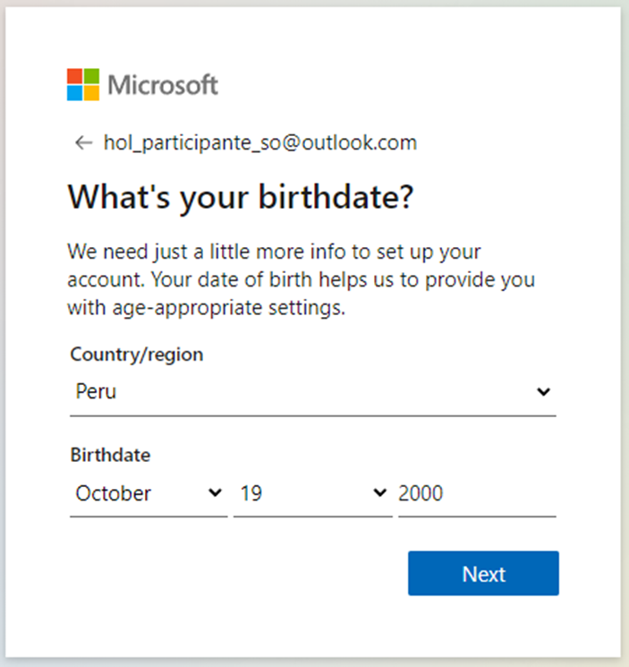
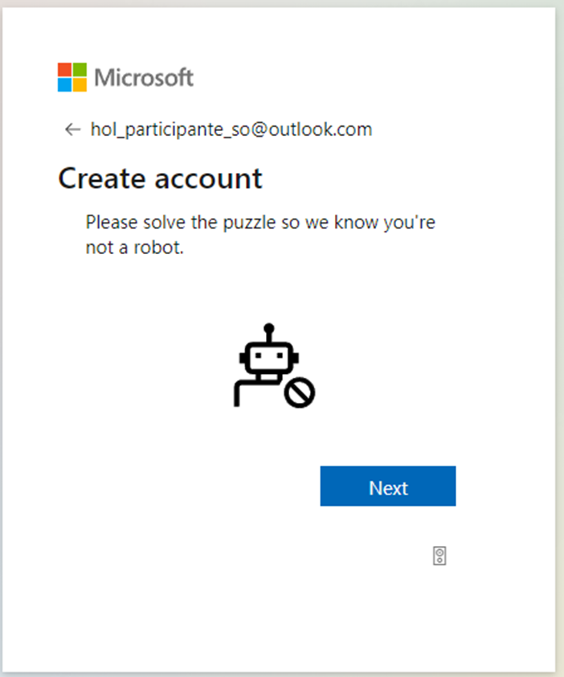
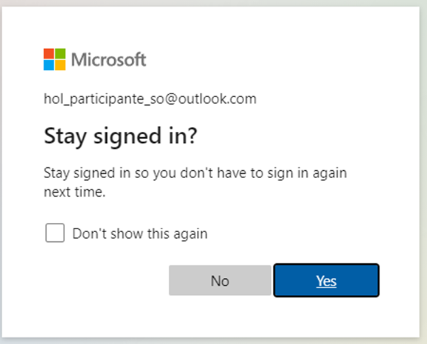
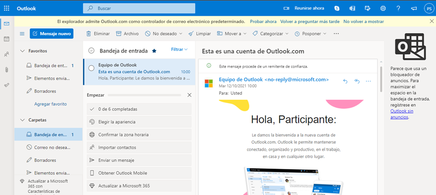

# Crear una cuenta de Outlook

Ingresamos al siguiente link <a href="https://outlook.live.com/owa/" target="_blank">https://outlook.live.com/owa/</a> y presionamos en crear una cuenta gratis 

- Agregamos el nombre de nuestro correo: hol_participante_"Inical de nombres y apellidos"

- Indicamos la contraseña

- Agregamos el nombre y apellido

- Seleccionamos nuestro pais y fecha de nacimiento

- Validar que no eres un robot

- Le damos en mantener iniciada la sesión

- Y Listo! Ya tendremos el correo creado, puedes continuar con la guía de IoT Central

