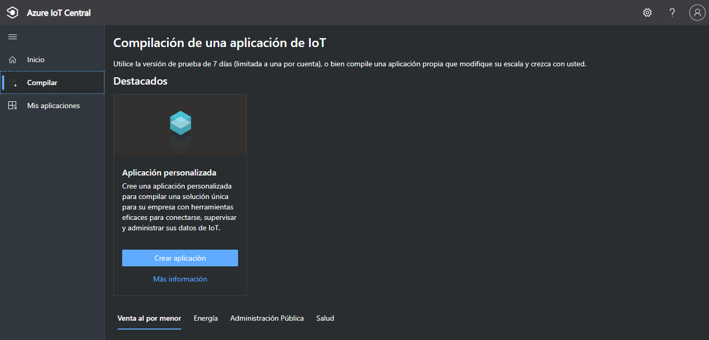
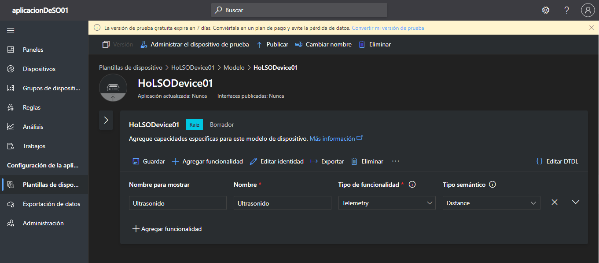

# IoT Central

En el siguiente documento explicaremos como usar IoT Central desde crear una cuenta hasta conectar hacia un dispositivo 

En caso de que no tengas una cuenta de Microsoft, Outlook o Hotmail puedes seguir los pasos de como crear en la guia: <a href="CrearCuentaOutlook.md" target="_blank">CrearCuentaOutlook.md</a> 

## En la siguiente guía aprenderemos:
* [Acceder a  IoT Central](#acceder-a-iot-central)
* [Crear una aplicacion](#crear-una-aplicacion)
* [Crear plantilla de dispositivos](#crear-plantilla-de-dispositivos)
* [Crear un Modelo y agregar funcionalidad](#crear-un-modelo-y-agregar-funcionalidad)
* [Configuracion de vistas](#configuracion-de-vistas)
* [Publicar](#publicar)
* [Crear un dispositivo](#crear-un-dispositivo)

### Acceder a IoT Central

Para crear una cuenta de IoT Central ingresaremos a la página pricinpal de IoT Central: <a href="https://apps.azureiotcentral.com/" target="_blank">https://apps.azureiotcentral.com/</a> 

Dentro de la pagina seleccionamos el icono del ángulo superior derecha de Iniciar sesión con una cuenta

Ingresamos el correo anteriormente creado u otra cuenta Outlook y click en **siguiente**

Para poder acceder ingresamos la contraseña, presionar en **Ingresar** o **Sign In**

Indicamos que queremos mantener la sesión iniciada, presionar en botón de **Sí** o **Yes**

### Crear una aplicacion 

En la ventana principal de IoT Central dar click en **Compilar** y luego en **Crear una Aplicacion**

En la espacio de nueva aplicacion ingresar:
- **Nombre de la aplicacion**: AplicacionDe[Inicial nombre][Inicial apellidos]XX 
- **URL**: Repite el nombre de aplicacion
- **Plantilla de aplicación**: Aplicacion personalizada 
- **Plan de precios**: Gratuito

Dar click en **Crear**

Nos abrirá una nueva ventana donde muestra las características de nuestra aplicación 

### Crear plantilla de dispositivos

Para crear una plantilla, en el panel lateral seleccionamos **Plantilla de dispositivo** 

En las opciones seleccionamos **Dispositivos IoT** y luego click en  **Siguiente:Personalizar** 

En **Nombre de la plantilla de dispositivo** escribir *HoL[Inicial Nombre y Apellido]Device[Numero de dispositivo]* Luego dar click en **Siguiente revisión**

Finalmente verificar la información básica y dar click en **Crear**

### Crear un Modelo y agregar funcionalidad
Para crear un modelo tenemos dos opciones, para este laboratorio seleccionaremos **Modelo personzalido**

En la nuevas opciones que aparece debajo de Modelo seleccionamos en el nombre de nuestro dipositivo, en el caso de la imagen inferior **HoLSODevice01**

Para agregar una nueva funcionalidad hacer click en cualquiera de las dos opciones de **+ Agregar funcionalidad**

A continuación en casilleros agregaremos una funcionalidad de **telemetría** con los siguientes datos:
#### Ultrasonido
- **Nombre para mostrar**: Ultrasonido
- **Nombre**: Ultrasonido
- **Tipo de funcionalidad**: Telemetry
- **Tipo semántico**: Distance

Repetir el paso de agregar más funcionalidades para los siguientes:
#### Temperatura
- **Nombre para mostrar**: Temperatura
- **Nombre**: Temperatura
- **Tipo de funcionalidad**: Telemetry
- **Tipo semántico**: Temperatura

#### Humedad
- **Nombre para mostrar**: Humedad
- **Nombre**: Humedad
- **Tipo de funcionalidad**: Telemetry
- **Tipo semántico**: Humidity

#### Servo
- **Nombre para mostrar**: Servo
- **Nombre**: Servo
- **Tipo de funcionalidad**: Telemetry
- **Tipo semántico**: Angle

#### Ldr
- **Nombre para mostrar**: Ldr
- **Nombre**: Ldr
- **Tipo de funcionalidad**: Telemetry
- **Tipo semántico**: Ninguno

#### Potenciometro
- **Nombre para mostrar**: Potenciometro
- **Nombre**: Potenciometro
- **Tipo de funcionalidad**: Telemetry
- **Tipo semántico**: Ninguno

Para agregar un **comando** configuramos de la siguiente manera:
#### Distancia a Persona
- **Nombre para mostrar**: Distancia a Persona
- **Nombre**: DistanciaAPersona
- **Tipo de funcionalidad**: Command

Para este último presionamos en expandir las opciónes de comando (Simbolo de flecha hacia abajo al costado de X)

Dentro de las opciones expandidas de comando solo configuraremos lo siguiente:
- **Solicitud**: Activado
- **Nompre para mostrar**: Distancia
- **Nombre**: Distancia
- **Esquema**: Double
- **Descripción**: Indique las distancia máxima a detectar

Por último agregamos una **propiedad**:
#### Alerta de Deteccion
- **Nombre para mostrar**: Alerta de Deteccion
- **Nombre**: AlertaDeDeteccion
- **Tipo de funcionalidad**: Property
- **Tipo semántico**: Ninguno

Una vez terminado de agregar las funcionalidad, damos click en **Guardar**

### Configuracion de vistas

#### 5.1. Vista de último valor conocido (LKV)
Dentro de las opciones de modelo ahora seleccionamos **Vistas**

Existen 3 tipos de vistas a crear, en este caso seleccionamos **Visualización de dispositivo**

En el nuevo panel escogemos **Comenzar por un objeto visual**

Dentro de las opciones de objetos visuales seleccionamos y arrastramos al espacio en blanco de la derecha  **Último valor conocido (LKV)**

Cerramos el panel presionando en la flecha hacia la izquierda **<**, luego en las opciones al costado de Título predeterminado seleccionamos el simbolo de engranaje o **configuración**

##### LDR
En el panel de la derecha configuramos lo siguiente:
- **Título**: LDR
- **Telemetría**: Click en **+ funcionalidad** y luego seleccionar **Ldr**
- **Tamaño del texto**: 25
- **Decimales**: 2

Una vez agregado y confurado los valores damos click ne **Actualizar**

En visualización con nombre LDR hacer click en la opción que tiene un Cuadro grande y dentro uno pequeño o **Tamaño disponible** y escogemos **1x1**

Repetir los pasos de arrastrar **Último valor conocido (LKV)** y luego **Configurar** con las siguientes opciones:

##### Servo
- **Título**: Servo
- **Telemetría**: Click en **+ funcionalidad** y luego seleccionar **Servo**
- **Tamaño del texto**: 25
- **Decimales**: 2
- **Tamaño disponible**: 1x1

##### Potenciometro
- **Título**: Potenciometro
- **Telemetría**: Click en **+ funcionalidad** y luego seleccionar **Potenciometro**
- **Tamaño del texto**: 25
- **Decimales**: 2
- **Tamaño disponible**: 1x1

##### Ultrasonido
- **Título**: Ultrasonido
- **Telemetría**: Click en **+ funcionalidad** y luego seleccionar **Ultrasonido**
- **Tamaño del texto**: 25
- **Decimales**: 2
- **Tamaño disponible**: 1x1

#### 5.2. Vista de Gráfico de líneas

Dentro de las opciones de objetos visuales seleccionamos y arrastramos al espacio en blanco de la derecha  **Gráfico de líneas**

Presionamos en el símbolo de configurar y escogemos lo siguiente:
##### Temperatura
- **Título**: Temperatura
- **Mostrar rango**: Últimos 30 minutos
- **Intervalo**: 1 minuto
- **Telemetría**: Temperatura
 

Luego dar click en **actualizar** de **Tamaño disponible**: 2x2

Repetir **Gráfico de líneas** para **Humedad** con las siguientes configuraciones:
##### Humedad
- **Título**: Humedad
- **Mostrar rango**: Últimos 30 minutos
- **Intervalo**: 1 minuto
- **Telemetría**: Humedad
- **Tamaño disponible**: 2x2

Click en el panel de editar vista y cambiar **Nombre de la vista** a *Vista de dispositivos*, luego click en **Guardar** 

### Publicar
Para publicar nuestra plantilla de dispositivo, dar click en **Publicar**

Finalmente mostrará un resúmen de todos los cambios que se realizaron, dar click en **Publicar** para confirmar

### Crear un dispositivo
Para crear un dispositivo en el panel principal de la derecha seleccionamos **Dispositivos** y después **Crear un dispositivo**

Dentro de las opcionas de Crear un dispositivo modificamos:
- **Nombre del dispositivo**: HoL[Inicial nombre y apellido]Device[número de dispositivo]
- **Id. de dispositivo**: Dejamos el valor que nos asignan
- **Plantilla de dispositivo**: Seleccionamos el nombre de nuestra plantilla, en es caso *HoLSODevice01* 
- **¿Quiere simular este dispositivo?**: Dejar la opción en No

Una vez finalizado le aparecera en lista el dispositivo que a creado relacionado a la plantilla, dar click sobre el nombre del dispositivo

En la nuevas opciones de visualización click en **Conectar**

Copiar en un bloc de notas los siguientes datos:
- **Id. de dispositivo**
- **Clave principal**

